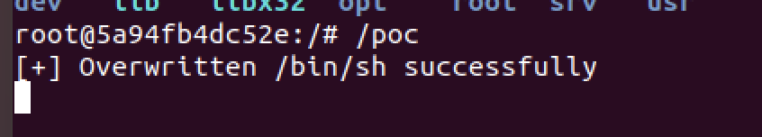
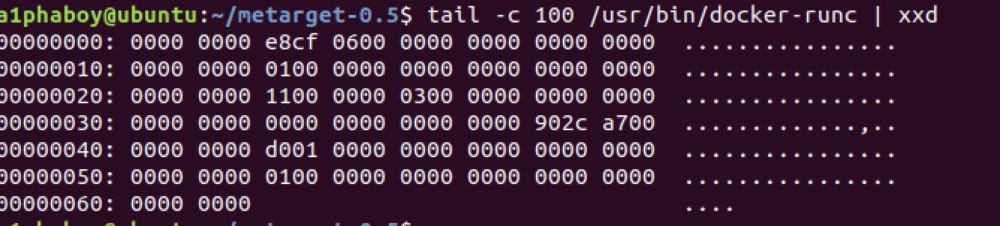

> **cve-2019-5736属于docker环境逃逸类型漏洞，该漏洞利用runC文件被覆盖，从而使攻击者达到逃逸并能执行宿主机命令的目的。**

<!-- more -->

## 利用条件

1. docker version <= `18.09.2`

2. runC version <= `1.0-rc6`
3. 容器内部`root`权限
***
## 复现

### 环境：

1. 宿主机 docker version `18.03.1-ce`,runC version `1.0-rc5`

### 步骤：

首先通过docker获取一个镜像 `sudo docker pull ubuntu`


将获取到的乌班图镜像启动`sudo docker run -it --name "myubuntu" ubuntu`


将[poc](https://github.com/Frichetten/CVE-2019-5736-PoC)进行编译后上传至docker容器中的根目录下`sudo docker cp main ID:/poc`,poc就是我们上传进去的文件。


`cat main.go | grep payload`

```go
var payload = "#!/bin/bash \n cat /etc/shadow > /tmp/shadow && chmod 777 /tmp/shadow"
```

如果该poc被成功执行的话，会将宿主机的shadow文件拷贝至/tmp/目录下，并将其权限修改为777

在容器中执行poc文件进行监听



然后在宿主机执行`sudo docker exec -it 5a94 /bin/sh`会发现没有交互式的shell打开


在docker容器中发现poc成功被执行


查看宿主机的/tmp/目录，发现存在权限为777的shadow文件


至此整个漏洞利用过程结束。
***

## 漏洞原理分析

### runC

runc是docker中最为核心的部分，容器的创建，运行，销毁等操作都是通过runc程序来完成的。我们查看runc文件如下：



当我们执行`docker run`等命令的时候实际上在底层调用的是runc程序，所以整个流程大概如下：


其中虚线表示，当runc生成一个子进程后runc程序将会结束占用。

当触发poc后，runc程序会被重写并执行：


### /proc/

根据[官方文档](https://man7.org/linux/man-pages/man5/proc.5.html),`/proc/`文件夹类似于一个文件系统，其中存放着各个进程与本地文件之间的映射，其中：

`/proc/[PID]/exe`:一种特殊的软连接，是该进程自身对应的本地文件

`/proc/[PID]/fd/`:这个目录下存放了该进程打开的所有文件描述符

`/proc/self/`:不同的进程访问该目录时获得的信息是不同的，内容等价于/proc/本进程pid/

`/proc/[PID]/exe`的特殊之处在于当权限通过的情况下打开这个文件，内核将会之间返回一个指向该文件的文件描述符，并非按照传统的打开方式做路径分析和文件查找，这就会导致绕过了mnt命名空间和chroot的限制。

当执行`docker exec`命令的时候，runc启动并加入到容器的命名空间中去，其实这个时候，容器内的进程已经能够通过内部的/proc/观察到它，因此通过打开/proc/[runc-PID]/exe可以获取宿主机上的runc文件标识符，由此能够达到覆盖的能力。
***

## POC分析

poc地址：[https://github.com/Frichetten/CVE-2019-5736-PoC](https://github.com/Frichetten/CVE-2019-5736-PoC)

### #!

​	在unix中，凡是被`#!`注释的，统统是加载器的路径，常见的有`#!/bin/sh`，表示将该注释后的代码交给`/bin/sh`处理，我们常见的处理python脚本一般在bash中输入`python run.py`，而如果在`run.py`中将注释换成`#!/path/to/python`，则在bash中执行`run.py`即可。

​	在此poc中，作者将`/bin/sh`进行了覆盖，修改成了`#!/proc/self/exe`,意义在于当宿主机执行`docker exec -it ID /bin/sh`时，`/bin/sh`将会替换成执行调用者自己，也就是宿主机下的runc文件，此时将会执行runc文件。

### "两个for循环"

在第一个for循环中，攻击者持续监测/proc/目录，当产生runc进程时，以可读的方式打开runc文件夹获取文件标识符。

在第二个for循环中，攻击者持续监听等待runc程序结束占用后就能够用之前循环获得的文件标识符以可写的方式向runc文件内写入payload。

### 攻击链流程图


***
## 参考链接

[《云原生安全-攻防实践与体系构建》](https://item.m.jd.com/product/13495676.html?utm_source=iosapp&utm_medium=appshare&utm_campaign=t_335139774&utm_term=Wxfriends&ad_od=share&utm_user=plusmember&gx=RnFjxWILYTTawtQcqIx0Xk3B0lfhlswhThMN)

[http://blog.nsfocus.net/runc-cve-2019-5736/](http://blog.nsfocus.net/runc-cve-2019-5736/)

[https://github.com/Frichetten/CVE-2019-5736-PoC](https://github.com/Frichetten/CVE-2019-5736-PoC)

[https://blog.csdn.net/lhh134/article/details/104107776](https://blog.csdn.net/lhh134/article/details/104107776)
